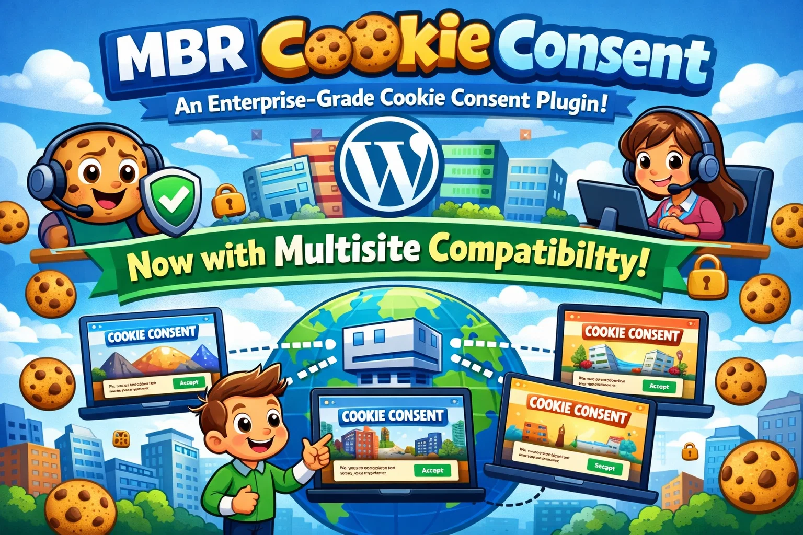
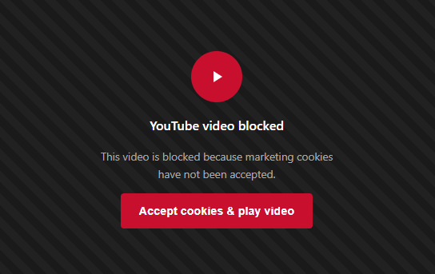

# MBR Cookie Consent

[](https://github.com/HarbourBob/mbr-cookie-consent/releases)
[](https://wordpress.org)
[](https://php.net)
[](https://www.gnu.org/licenses/gpl-2.0.html)
[](https://littlewebshack.com)
[](https://littlewebshack.com)
[](https://iabeurope.eu)



> **Enterprise-grade GDPR, CCPA & global privacy compliance for WordPress — completely free, forever. No upsells. No vendor lock-in.**

---

## 🌟 Why MBR Cookie Consent?

| | MBR Cookie Consent | Typical Premium Plugins |
|---|---|---|
| **Price** | ✅ Free forever | ❌ £99–£299/year |
| **IAB TCF v2.3** | ✅ Included | ❌ Premium only |
| **Google Consent Mode v2** | ✅ Included | ❌ Premium only |
| **40+ Language Auto-Translation** | ✅ Included | ❌ Premium only |
| **Form Builder Integration** | ✅ Included | ❌ Premium only |
| **A/B Testing** | ✅ Included | ❌ Premium only |
| **Geolocation Detection** | ✅ Included | ❌ Premium only |
| **Multisite Support** | ✅ Included | ❌ Premium only |
| **Vendor lock-in** | ✅ None | ❌ Proprietary |

---

## ✨ Features

### 🛡️ Consent Management
- **Customisable Banner** — Accept All, Reject All, and Customise options
- **Automatic Script Blocking** — blocks non-essential scripts until explicit consent is given
- **Preference Centre** — granular category-by-category control for visitors
- **Revisit Consent Button** — floating button so visitors can update preferences any time
- **CCPA "Do Not Sell"** — optional link for California residents
- **Consent Logging** — every interaction recorded, exportable to CSV
- **GDPR-Compliant Storage** — IP anonymisation and proper data handling
- **Geolocation Detection** — auto-detects visitor country and displays the appropriate banner *(v1.6.0)*
- **Multisite Support** — network-aware, adjusts settings across sites automatically *(v1.5.0)*

---

### 📊 Consent Mode Integration
- **Google Consent Mode v2** — full integration with `ad_storage`, `ad_user_data`, `ad_personalization`, `analytics_storage`, `functionality_storage`, `personalization_storage`
- **Microsoft UET Consent Mode** — EU consent requirements for Microsoft Advertising
- Configurable default states (recommended: denied for EU/EEA)
- Ads data redaction and optional URL passthrough

---

### 🌍 Internationalisation & Accessibility
- **40+ Language Auto-Translation** — detects browser language, no configuration needed
- **WPML & Polylang** compatible — full string registration and translation support
- **WCAG 2.1 AA** compliant — full keyboard navigation, screen reader support, focus traps, ARIA labels, high contrast and reduced motion support

---

### 🎨 Banner Customisation
- **Layout Options** — Bar (full width), Box (bottom left/right), Popup (centre)
- **Colour Customisation** — primary, accept, reject, and text colours
- **Custom Text** — fully customisable heading, description, and all button labels
- **Reload on Consent** — optional page reload after consent action

---

### 🔍 Cookie Scanner & Management
- **One-Click Scanner** — detects scripts and iframes across your site automatically
- **Manual Management** — add, edit, or remove blocked scripts at any time
- **Category Management** — organise by Necessary, Analytics, Marketing, Preferences

---

### 📝 Form Builder Integration *(v1.9.0)*

Blocks form submissions **server-side** until consent is granted — cannot be bypassed by disabling JavaScript.



- **Supported builders** — Contact Form 7, WPForms, Gravity Forms, Elementor Forms
- **Elementor modal** — clean dark overlay modal replaces inline errors, with Accept Cookies and Not Now buttons
- **Auto re-submit** — after accepting cookies the pending form re-submits automatically with all data intact
- **Configurable** — choose required consent category and customise the blocked message

---

### 🧪 A/B Testing *(v1.9.0)*

Optimise your consent rate by testing banner position variants against real visitor data.

- **Three variants** — Bottom bar (A), Popup (B), Box-left (C)
- **Session persistence** — same visitor always sees the same variant
- **Conversion tracking** — impressions and accept-all rate tracked per variant
- **Results dashboard** — live table with accept rates, bar charts, and winner indicator
- **Promote winner** — one click sets the winning variant as your live position

---

### ⚖️ Legal Policy Tools
- **Privacy Policy Generator** — creates a comprehensive WordPress privacy policy page
- **Cookie Policy Generator** — creates a WordPress cookie policy page template
- **Legal Disclaimers** — built-in throughout the admin interface

---

## 🚀 Installation

### From Little Web Shack *(recommended)*

1. Visit [littlewebshack.com](https://littlewebshack.com) and download MBR Cookie Consent
2. Upload via **Plugins > Add New > Upload Plugin** in WordPress admin
3. Activate the plugin
4. Add to `wp-config.php` to enable geolocation:
   ```php
   define('MBR_CC_FORCE_GEOLOCATION', true);
   ```
5. Go to **Cookie Consent > Dashboard** to configure

### Manual Installation

1. Download the plugin ZIP from [GitHub Releases](https://github.com/HarbourBob/mbr-cookie-consent/releases)
2. Upload to `/wp-content/plugins/mbr-cookie-consent/`
3. Activate through the **Plugins** menu
4. Add the geolocation constant to `wp-config.php` (see above)

---

## ⚡ Quick Start

### 1️⃣ Scan your site
Go to **Cookie Consent > Cookie Scanner**, click **Start Scan**, review detected scripts, and add anything non-essential to the blocked list.

### 2️⃣ Configure categories
Go to **Cookie Consent > Categories** and customise category names and descriptions to match your privacy policy.

### 3️⃣ Customise your banner
Go to **Cookie Consent > Settings** — set position, colours, text, and enable any optional features (Reject button, CCPA link, etc.).

### 4️⃣ Generate your Cookie Policy
Go to **Cookie Consent > Dashboard**, click **Generate Cookie Policy Page**, review the draft, and publish.

### 5️⃣ Test
Open an incognito window, visit your site, and verify Accept All / Reject All / Customise all behave correctly and scripts are blocked or unblocked as expected.

---

## 🔧 Google & Microsoft Consent Mode Setup

### Google Consent Mode v2

1. Go to **Cookie Consent > Settings > Consent Mode Integration**
2. Enable **Google Consent Mode v2**
3. Set defaults — **Denied** is recommended for EU/EEA compliance
4. Enable **Ads Data Redaction** for additional privacy protection
5. Your existing GA4/Google Ads tags will automatically receive consent signals — no changes needed

**Consent types controlled:** `ad_storage` · `ad_user_data` · `ad_personalization` · `analytics_storage` · `functionality_storage` · `personalization_storage`

### Microsoft UET Consent Mode

1. Go to **Cookie Consent > Settings > Consent Mode Integration**
2. Enable **Microsoft UET Consent Mode**
3. Set default to **Denied** for GDPR compliance
4. Your existing UET tags will automatically receive consent signals

> 💡 Consent mode works **alongside** script blocking, not instead of it. Tags still load but behave differently based on consent signals.

---

## 📦 Managing Blocked Scripts

### Via the Scanner *(easiest)*
**Cookie Consent > Cookie Scanner** → **Start Scan** → **Add to Blocked List**

### Manually
**Cookie Consent > Cookie Scanner** → scroll to **Add Custom Script** and fill in:

| Field | Description | Example |
|---|---|---|
| **Name** | Display name | `Google Analytics` |
| **Identifier** | URL or content pattern | `google-analytics.com/analytics.js` |
| **Type** | `src`, `inline`, or `iframe` | `src` |
| **Category** | `necessary`, `analytics`, `marketing`, `preferences` | `analytics` |

---

## 🗂️ Cookie Categories

| Category | Description | Always Active |
|---|---|---|
| 🔒 **Necessary** | Essential for site functionality — session, security | ✅ Yes |
| 📈 **Analytics** | Usage tracking — Google Analytics, Matomo | ❌ Consent required |
| 📣 **Marketing** | Advertising & retargeting — Facebook Pixel, Google Ads | ❌ Consent required |
| ⚙️ **Preferences** | User preference storage — language, UI settings | ❌ Consent required |

---

## 📋 Consent Logging

All consent interactions are logged with:

- 🕐 Timestamp
- 👤 User ID (if logged in)
- 🌐 Anonymised IP address
- ✅ Consent given (yes/no)
- 📂 Categories accepted
- 🖱️ Consent method (accept_all / reject_all / preferences)

**Export:** Cookie Consent > Consent Logs > **Export to CSV**

**Housekeeping:** Cookie Consent > Consent Logs → specify days → **Delete Old Logs**

---

## ✅ Compliance Summary

### GDPR
- ✅ Explicit opt-in for all non-essential cookies
- ✅ Clear information about cookie usage
- ✅ Easy consent revocation
- ✅ IP address anonymisation
- ✅ Full consent audit log
- ✅ Granular category control
- ✅ Cookie & Privacy Policy generator

### CCPA
- ✅ "Do Not Sell or Share My Personal Information" link
- ✅ Opt-out mechanism
- ✅ Clear disclosure of data collection

### IAB TCF v2.3
- ✅ Full `__tcfapi` JavaScript API
- ✅ TC String generation and storage
- ✅ 10 standard consent purposes
- ✅ Global Vendor List integration ready

---

## 🛠️ Developer Notes

### Programmatic Consent Check

```javascript
// Check if analytics consent has been granted
window.MbrCcConsent.hasCategoryConsent('analytics', function(allowed) {
    if (allowed) {
        // Load your analytics script
    }
});
```

### Script Blocking Mechanism

The plugin uses PHP output buffering to intercept HTML before it reaches the browser. Blocked scripts have their `type` attribute changed to `text/plain` and receive a `data-mbr-cc-blocked` attribute. On consent, scripts are restored and executed client-side.

### Hooks & Filters

Coming in a future version.

---

## 📋 Technical Requirements

| Requirement | Minimum |
|---|---|
| WordPress | 5.8 or higher |
| PHP | 7.4 or higher |
| MySQL | 5.6 or higher |

---

## 🗺️ Roadmap

- ✅ Google Consent Mode v2 *(v1.1.0)*
- ✅ Microsoft UET Consent Mode *(v1.1.0)*
- ✅ Auto-translation — 40+ languages *(v1.2.0)*
- ✅ WPML & Polylang compatibility *(v1.2.0)*
- ✅ WCAG/ADA accessibility *(v1.2.0)*
- ✅ Page-specific banner controls *(v1.3.0)*
- ✅ Custom CSS editor *(v1.3.0)*
- ✅ Subdomain consent sharing *(v1.3.0)*
- ✅ IAB TCF v2.3 *(v1.4.0)*
- ✅ Google Additional Consent Mode *(v1.4.0)*
- ✅ Privacy Policy Generator *(v1.4.1)*
- ✅ Multisite support *(v1.5.0)*
- ✅ Geolocation detection *(v1.6.0)*
- ✅ Form builder integration *(v1.9.0)*
- ✅ A/B testing for banner variations *(v1.9.0)*
- 🔲 Consent Mode API for developers

---

## 📜 Changelog

### 1.9.1 — Bug Fixes
- **Elementor Forms modal** — dual-strategy intercept (fetch + XHR) ensures the modal always shows instead of inline errors
- **Form auto re-submit** — raw request body captured and replayed after consent; page no longer reloads and clears the form
- **Form blocking hard-stops** — CF7 uses `wpcf7_spam` filter; WPForms blocks entry saving and email notifications; Elementor uses direct `wp_send_json` response
- **Remove last blocked script** — DOM re-indexes remaining items after each removal to stay in sync with server
- **Delete Old Logs UI** — restored to Consent Logs page (handler existed, HTML form was missing)
- **Blocked content placeholder** — always renders when an iframe is blocked, regardless of admin toggle
- **Service-specific messaging** — placeholder shows e.g. "YouTube video blocked"
- **Branding logo** — recommended size corrected to 150×150 px

### 1.9.0 — Form Integration & A/B Testing
- **New:** Form Builder Integration — CF7, WPForms, Gravity Forms, Elementor Forms
- **New:** A/B Testing — three banner position variants with conversion tracking and one-click winner promotion

### 1.8.1 — Bug Fixes
- Banner reappearance after consent resolved
- Cookie write verification and domain scoping fallback
- Blocked content placeholder style update and service-specific messaging

### 1.8.0 — Elementor Video Blocking
- Elementor YouTube widget blocking pending consent
- Built-in service library (YouTube, Vimeo, Google Maps, and more)
- WP Rocket lazy-load compatibility
- Per-category unblocking fix

### 1.7.0 — Blocked Content Overlay
- Branded placeholder shown in place of blocked iframes

### 1.6.0 — Geolocation
- Auto-detects visitor country, displays region-appropriate banner (GDPR/CCPA/LGPD/PIPEDA)

### 1.5.0 — Multisite
- Network-aware with automatic detection and settings adjustment

### 1.4.1 — Privacy Policy Generator
- Intelligent generator that analyses site configuration

### 1.4.0 — IAB TCF v2.3 & Google ACM
- Full `__tcfapi` implementation, TC String generation, Google Additional Consent Mode

### 1.3.0 — Enhanced Customisation
- Page-specific controls, custom CSS editor, subdomain consent sharing

### 1.2.0 — Internationalisation & Accessibility
- 40+ language auto-translation, WPML/Polylang, WCAG 2.1 AA

### 1.1.0 — Consent Mode Integration
- Google Consent Mode v2, Microsoft UET Consent Mode

### 1.0.0 — Initial Release
- Banner, script blocking, categories, preference centre, consent logging, scanner, CSV export, cookie policy generator

---

## 💬 Support

| Channel | Link |
|---|---|
| 🌐 Website | [littlewebshack.com](https://littlewebshack.com) |
| 📧 Email | [rob@littlewebshack.com](mailto:rob@littlewebshack.com) |
| 🐙 GitHub | [github.com/HarbourBob](https://github.com/HarbourBob) |
| 📖 Docs | See plugin admin pages |

---

## 📄 License

GPL v2 or later — free to use, modify, and distribute.

---

> ⚠️ **Legal Disclaimer:** This plugin provides technical tools to help implement cookie consent mechanisms. It does not constitute legal advice. Always consult a qualified legal professional for compliance guidance specific to your situation.

---

<div align="center">

Made with ❤️ by Robert Palmer in Cleethorpes, England

**[Little Web Shack](https://littlewebshack.com)** · **[Made by Robert](https://madeberobert.co.uk)**

</div>
