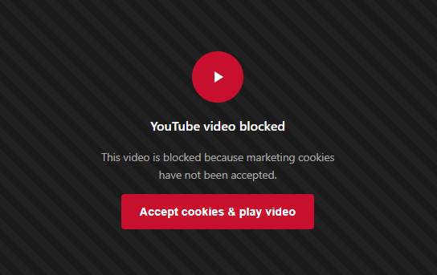

<div align="center">


# MBR Cookie Consent

### Enterprise-grade privacy compliance for WordPress. Genuinely free, forever.

**GDPR · UK DUAA · CCPA · 24 US state laws · LGPD · PIPEDA · Quebec Law 25 · Swiss nFADP<br>Australia Privacy Act · India DPDP · Vietnam PDPL · Indonesia UU PDP · Nigeria NDPA<br>China PIPL · South Korea PIPA · Saudi PDPL · South Africa POPIA · Global Privacy Control**

No premium tier. No upsells. No telemetry. No vendor lock-in. No third-party logo on your banner.

<br>

[](https://github.com/HarbourBob/mbr-cookie-consent/releases)
[](https://wordpress.org)
[](https://php.net)
[](https://www.gnu.org/licenses/gpl-2.0.html)
[](https://github.com/harbourbob/mbr-cookie-consent/releases)

[](https://littlewebshack.com)
[](https://littlewebshack.com)
[](https://iabeurope.eu)
[](https://globalprivacycontrol.org)

<br>

**[Download](https://littlewebshack.com)** · **[Releases](https://github.com/HarbourBob/mbr-cookie-consent/releases)** · **[Report an issue](https://github.com/HarbourBob/mbr-cookie-consent/issues)**

</div>

---

## Why this exists

Privacy compliance became something small businesses were expected to pay £99–£299 a year for — often in exchange for a banner carrying somebody else's logo.

This plugin takes the opposite view. Every feature you would expect from an enterprise consent platform is in the free version, fully documented, and yours to configure. No feature is held back behind a paywall, because there is no paywall.

It is built the way I build everything: pure PHP, no Composer, no external dependencies, no CDN calls, no telemetry, and updates served straight from the developer.

---

## What you get

|  |  |
|---|---|
| **Real script blocking** | Non-essential scripts are held at the server via output buffering and never execute until consent is given. Not a banner that hides and hopes. |
| **Server-side form gating** | Form submissions are blocked on the server until consent is granted — cannot be bypassed by disabling JavaScript. |
| **Automatic regional compliance** | Sixteen detected privacy regions, each with the correct consent model applied automatically. |
| **Consent Mode v2 + TCF v2.3** | Google Consent Mode v2, Microsoft UET Consent Mode, IAB TCF v2.3, Google Additional Consent. |
| **Global Privacy Control** | The `Sec-GPC` browser signal detected server-side and client-side, and honoured automatically. |
| **AI / LLM training disclosure** | Connecticut SB 1295 requires your privacy notice to state whether personal data trains large language models. Built in. *(v2.3.0)* |
| **Settings portability** | Export a tuned configuration to JSON and import it on any number of other sites. *(v2.2.0)* |
| **Audit-ready logging** | Every consent interaction recorded with anonymised IP, exportable to CSV. |
| **40+ languages** | Browser-language auto-translation, plus full WPML and Polylang string registration. |
| **WCAG 2.1 AA** | Keyboard navigation, screen reader support, focus traps, ARIA labels, reduced-motion support. |

---

## Free vs. the alternatives

| | MBR Cookie Consent | Typical premium plugins |
|---|---|---|
| **Price** | Free forever | £99–£299/year |
| **IAB TCF v2.3** | Included | Premium only |
| **Google Consent Mode v2** | Included | Premium only |
| **Global Privacy Control** | Included | Premium only |
| **UK DUAA 2025 compliance** | Included | Premium only |
| **US multi-state coverage** | Included | Premium only |
| **AI / LLM training disclosure** | Included | Rarely offered at all |
| **40+ language auto-translation** | Included | Premium only |
| **Server-side form gating** | Included | Rarely offered at all |
| **Settings import / export** | Included | Premium only |
| **A/B testing** | Included | Premium only |
| **Geolocation detection** | Included | Premium only |
| **Multisite support** | Included | Premium only |
| **Telemetry / phone-home** | None | Common |
| **Vendor lock-in** | None | Proprietary |

---

## Global privacy coverage

Visitor location is detected automatically and the correct consent model applied — one configuration, every jurisdiction.

| Region | Law | Consent model | Since |
|---|---|---|---|
| **EU / EEA** | GDPR + ePrivacy | Strict opt-in for all non-essential cookies | v1.6.0 |
| **United Kingdom** | UK GDPR + DUAA 2025 | Analytics & functionality exempt (opt-out); advertising requires consent | v2.0.0 |
| **Switzerland** | nFADP | Transparency-led, opt-out | v2.1.0 |
| **United States** | CCPA/CPRA + state laws | Opt-out, with GPC honoured | v2.0.0 |
| **Quebec** | Law 25 | Express opt-in | v2.1.0 |
| **Canada (rest)** | PIPEDA / CASL | Meaningful consent | v1.6.0 |
| **Brazil** | LGPD | Opt-in, GDPR-style | v1.6.0 |
| **Australia** | Privacy Act | Notice and reasonable expectation | v2.1.0 |
| **India** | DPDP Act 2023 | Granular opt-in, one-click withdrawal | v2.0.0 |
| **Vietnam** | PDPL 91/2025/QH15 | Opt-in, granular per-purpose consent | v2.1.1 |
| **Indonesia** | UU PDP No. 27/2022 | Opt-in, purpose-specific with easy withdrawal | v2.1.2 |
| **Nigeria** | NDPA 2023 + GAID 2025 | Opt-in, prominent homepage notice mandated | v2.3.0 |
| **China** | PIPL | Explicit opt-in, granular per-purpose | v2.3.0 |
| **South Korea** | PIPA | Specific, informed, prior consent | v2.3.0 |
| **Saudi Arabia** | PDPL | Opt-in, Arabic banner heading by default | v2.3.0 |
| **South Africa** | POPIA | Opt-in for electronic direct marketing (s.69) | v2.3.0 |
| **Rest of world** | Best practice | Opt-in by default; configurable | v1.6.0 |

> **US state laws:** 24 states have now enacted comprehensive privacy laws, 20 of them currently in effect. All follow the Virginia opt-out model, so no banner behaviour changes as more come into force.

> **China PIPL — documented limitation:** PIPL requires *separate* standalone consent for cross-border transfers, plus a transfer mechanism (CAC assessment, standard contract, or certification). This plugin does **not** provide either. If you serve mainland China, handle that separately.

---

## New in 2.3

### Five new privacy regions *(v2.3.0)*

Nigeria (NDPA + GAID), China (PIPL), South Korea (PIPA), Saudi Arabia (PDPL) and South Africa (POPIA) are now detected separately, each with its own consent model, compliance card and — where appropriate — a localised banner heading.

Nigeria's GAID is worth singling out: effective 19 September 2025, it is one of the few instruments anywhere that prescribes *banner placement*. A prominent homepage notice is required — a footer link is not sufficient — with a genuine accept/decline choice, no pre-ticked boxes, and no implied consent from continued browsing.

### AI / LLM training disclosure *(v2.3.0)*

Connecticut SB 1295, effective 1 July 2026, is the first US state law requiring your privacy notice to state whether you collect, use, or sell personal data to train large language models. A new section under Advanced Consent controls this, and the privacy policy generator produces matching text — including a clear "we do not" statement when none of the options apply, which is the correct answer for most sites.

### "Rest of World" now defaults to opt-in *(v2.3.0)*

The fallback region previously shipped with implied consent and auto-accept-on-scroll, which was wrong for the several genuine opt-in jurisdictions that fall through to it.

**Existing sites are not changed.** An upgrade routine writes your previous values as explicit settings, so only new installations get the stricter posture. You can change it either way under Geolocation.

### Security release *(v2.3.1)*

Version 2.3.1 is the outcome of a full security audit of the plugin's own source code. Eleven security findings and seven reliability findings were identified and fixed. No exploitation was reported — everything was found by review.

The headline items:

- **Forwarding headers are no longer trusted blindly.** `X-Forwarded-For`, `X-Real-IP` and `CF-Connecting-IP` can be set by any visitor. Trusting them meant a visitor could nominate their own IP — and therefore their own privacy regime — and could mint unlimited distinct "IPs", each creating a cache entry and an outbound lookup. A new **Visitor IP Detection** setting controls this. The default validates Cloudflare's header against Cloudflare's own published ranges, so Cloudflare sites keep working with no configuration.
- **Geolocation lookups no longer run over plain HTTP.** ip-api.com serves HTTPS only on its paid tier. Over plain HTTP the country returned can be rewritten in transit, silently changing which privacy regime a visitor receives, and visitor IPs travel to a third party unencrypted. Sites using it without a key are migrated to ipapi.co (free, HTTPS) with a dismissible notice explaining why.
- **The consent log is throttled.** The logging endpoint has to accept unauthenticated requests, because a nonce baked into cached HTML goes stale. It now rate-limits per visitor, so the record you would rely on to demonstrate compliance cannot be flooded with junk.
- **Blocked scripts now restore reliably.** A missing variable binding left `src`-blocked scripts without a category label, so after a visitor accepted cookies those scripts could silently fail to start. If you use script blocking, this is the fix that matters most.
- **Subdomain consent sharing works on `.co.uk`.** The root domain was calculated as the last two labels, so `shop.example.co.uk` produced a cookie scoped to `co.uk` — which every browser rejects. Affected all of `.co.uk`, `.com.au`, `.co.nz` and similar.

Full detail in the [changelog](#changelog) and the [security audit report](MBR-Cookie-Consent-Security-Audit.pdf).

> **If you use A/B testing, reset your statistics after updating.** Impressions were counted on every page load rather than once per visitor, so existing figures are inflated — and not evenly across variants. Any promote-winner decision made on the old data is unsound.

---

## Security

The plugin's source code was audited in full at version 2.3.0 and every finding was remediated in 2.3.1.

**[Read the security audit report (PDF)](MBR-Cookie-Consent-Security-Audit.pdf)**

The audit was carried out by Claude (claude.ai), an AI assistant made by Anthropic, at my request. It was a static source code review — not a penetration test, not an accredited third-party audit, and it carries no warranty or certification. The report states its own limitations plainly, and I would rather publish it with those caveats attached than not publish it at all.

What it found clean is worth stating: no SQL injection, no cross-site scripting, no missing permission or nonce checks across the plugin's twenty administrative actions, and none of the PHP functions commonly associated with serious vulnerabilities. What it found wrong clustered in one place — the endpoints that must accept requests from ordinary visitors rather than logged-in administrators, which is genuinely awkward territory for a consent plugin when page caching makes nonces unreliable.

Found something? Email **[rob@littlewebshack.com](mailto:rob@littlewebshack.com)** rather than opening a public issue, and I will credit you here unless you would rather I did not.

---

## Install

**From Little Web Shack** *(recommended — includes automatic updates)*

1. Download from **[littlewebshack.com](https://littlewebshack.com)**
2. Upload via **Plugins → Add New → Upload Plugin**, then **Activate**
3. Enable geolocation by adding this to `wp-config.php`:
   ```php
   define('MBR_CC_FORCE_GEOLOCATION', true);
   ```
4. Configure at **Cookie Consent → Dashboard**

**From GitHub** — grab the ZIP from [Releases](https://github.com/HarbourBob/mbr-cookie-consent/releases), upload to `/wp-content/plugins/mbr-cookie-consent/`, activate, and add the constant above.

---

## Quick start

| Step | Where | What to do |
|---|---|---|
| **1. Scan** | Cookie Consent → Cookie Scanner | **Start Scan**, review detected scripts, add non-essential ones to the blocked list |
| **2. Categorise** | Cookie Consent → Categories | Match category names and descriptions to your privacy policy |
| **3. Style** | Cookie Consent → Settings | Position, colours, text, and optional features |
| **4. Generate policy** | Cookie Consent → Dashboard | **Generate Cookie Policy Page**, review, publish |
| **5. Test** | Incognito window | Verify Accept / Reject / Customise all behave, and scripts block correctly |

To test GPC, use Firefox or Brave with the signal enabled and confirm the "Opt-Out Request Honored" toast appears.

**Behind Cloudflare or a reverse proxy?** Check **Settings → Geolocation → Visitor IP Detection**. The default handles Cloudflare automatically. For any other proxy or load balancer, switch to reverse-proxy mode and list your proxy addresses, or geolocation will see the proxy rather than the visitor.

---

<details>
<summary><h3>Full feature list</h3></summary>

### Consent management
- **Customisable banner** — Accept All, Reject All, Customise
- **Automatic script blocking** — non-essential scripts held until explicit consent
- **Preference centre** — granular category-by-category control
- **Revisit consent button** — floating button so visitors can change their mind any time
- **CCPA "Do Not Sell or Share"** — required opt-out link for US visitors
- **Global Privacy Control** — automatic detection and honouring of the GPC signal *(v2.0.0)*
- **Consent logging** — every interaction recorded, exportable to CSV
- **GDPR-compliant storage** — IP anonymisation and proper data handling
- **Geolocation detection** — auto-detects country and applies the right regime *(v1.6.0)*
- **Spoof-resistant IP detection** — proxy headers honoured only from verified proxies *(v2.3.1)*
- **Multisite support** — network-aware, adjusts settings across sites *(v1.5.0)*
- **Settings import / export** — portable JSON configuration with one-step revert *(v2.2.0)*

### Consent Mode integration
- **Google Consent Mode v2** — `ad_storage`, `ad_user_data`, `ad_personalization`, `analytics_storage`, `functionality_storage`, `personalization_storage`
- **Microsoft UET Consent Mode** — EU consent requirements for Microsoft Advertising
- Configurable default states (denied recommended for EU/EEA)
- Ads data redaction and optional URL passthrough

### Global Privacy Control *(v2.0.0)*
When a browser sends `Sec-GPC: 1` (Firefox, Brave, DuckDuckGo, Privacy Badger), the plugin:
- Detects the signal server-side (PHP) and client-side (JavaScript)
- Suppresses marketing cookies without requiring banner interaction
- Shows the California-mandated "Opt-Out Request Honored" confirmation toast
- Logs GPC status alongside the consent record
- Applies a server-side backstop forcing marketing consent to `false` regardless of cookie state

Enabled by default. To also suppress analytics, enable `mbr_cc_gpc_suppress_analytics`, or filter the categories via `mbr_cc_gpc_suppressed_categories`.

### AI / LLM training disclosure *(v2.3.0)*
Connecticut SB 1295 (effective 1 July 2026) requires privacy notices to state whether personal data is used to train large language models. Under **Advanced Consent** you can declare whether you:
- train your own models on personal data
- share personal data with AI vendors for training
- sell personal data for AI training

The privacy policy generator writes matching text, including an explicit "we do not" statement when none apply — which is the right answer for most sites, and worth saying out loud rather than staying silent.

### Banner customisation
- **Layouts** — bar (full width), box (bottom left/right), popup (centre)
- **Colours** — primary, accept, reject, and text colours
- **Custom text** — heading, description, and every button label
- **Logo** — your own branding on the banner and preference centre
- **Reload on consent** — optional page reload after a consent action

### Cookie scanner and management
- **One-click scanner** — detects scripts and iframes across your site
- **Manual management** — add, edit, or remove blocked scripts at any time
- **Category management** — Necessary, Analytics, Marketing, Preferences

### Form builder integration *(v1.9.0)*

Blocks form submissions **server-side** until consent is granted — cannot be bypassed by disabling JavaScript.



- **Supported** — Contact Form 7, WPForms, Gravity Forms, Elementor Forms
- **Elementor modal** — clean dark overlay replaces inline errors, with Accept Cookies and Not Now
- **Auto re-submit** — after accepting, the pending submission replays automatically with all data intact
- **Configurable** — choose the required category and customise the blocked message

### A/B testing *(v1.9.0)*
- **Three variants** — bottom bar (A), popup (B), box-left (C)
- **Session persistence** — the same visitor always sees the same variant
- **Conversion tracking** — impressions and accept-all rate per variant, deduplicated per visitor *(v2.3.1)*
- **Results dashboard** — live table, bar charts, winner indicator
- **Promote winner** — one click sets the winning variant live

### Internationalisation and accessibility
- **40+ languages** — browser-language detection, no configuration needed
- **WPML and Polylang** — full string registration and translation support
- **WCAG 2.1 AA** — keyboard navigation, screen readers, focus traps, ARIA labels, high contrast, reduced motion

### Legal policy tools
- **Privacy Policy Generator** — builds a policy page from your actual site configuration, including AI training disclosure
- **Cookie Policy Generator** — creates a cookie policy page template
- **Legal disclaimers** — built in throughout the admin interface

</details>

<details>
<summary><h3>Compliance summary by region</h3></summary>

### EU / EEA — GDPR + ePrivacy
Explicit opt-in for all non-essential cookies · clear information about usage · easy revocation · IP anonymisation · full audit log · granular category control · policy generators. EEA non-EU members (Iceland, Liechtenstein, Norway) included since v2.1.0.

### United Kingdom — UK GDPR + DUAA 2025
Analytics, functionality, security and software-update cookies exempt from consent under DUAA Schedule A1 · transparency and easy opt-out still required · advertising still requires explicit consent · PECR fines up to £17.5M or 4% of global turnover · formal complaints procedure in force since 19 June 2026.

### United States — CCPA/CPRA + state laws
"Do Not Sell or Share My Personal Information" link · GPC honoured automatically · California-required "Opt-Out Request Honored" confirmation · opt-out model · clear disclosure. 24 states enacted, 20 in effect; all follow the Virginia opt-out model. Connecticut SB 1295 adds AI training disclosure from 1 July 2026, with SB 4 following on 1 October 2026.

### Switzerland — nFADP *(v2.1.0)*
Transparency-led with opt-out, distinct from GDPR.

### Quebec — Law 25 *(v2.1.0)*
Express opt-in, detected separately from the rest of Canada.

### Canada — PIPEDA / CASL
Meaningful consent with purpose disclosure · CASL classifies cookies as computer programs requiring consent.

### Australia — Privacy Act *(v2.1.0)*
Notice-based with reasonable-expectation standard.

### Brazil — LGPD
Opt-in consent with Portuguese defaults · revocation · data minimisation.

### India — DPDP Act 2023
Granular consent with one-click withdrawal · standalone privacy notice · verifiable parental consent for minors · Consent Manager registration opens November 2026 · full compliance mandatory by May 2027.

### Vietnam — PDPL *(v2.1.1)*
Law 91/2025/QH15, in force 1 January 2026. Consent-centric: silence is not consent, bundled consent prohibited, withdrawal must be easy. Vietnamese-language banner heading by default.

### Indonesia — UU PDP *(v2.1.2)*
Law No. 27 of 2022, fully effective since 17 October 2024 and upheld by the Constitutional Court in January 2026. GDPR-style and extraterritorial, with purpose-specific consent and an Indonesian-language heading by default.

### Nigeria — NDPA + GAID *(v2.3.0)*
Nigeria Data Protection Act 2023, with the NDPC's General Application and Implementation Directive effective 19 September 2025. Unusually prescriptive about placement: a prominent homepage notice is required, a footer link is not sufficient, and a genuine accept/decline choice must be offered. No pre-ticked boxes and no implied consent from browsing. Only strictly necessary cookies are exempt. Extraterritorial.

### China — PIPL *(v2.3.0)*
Explicit, voluntary, fully informed opt-in before non-essential cookies. Cookie identifiers that single out a visitor count as personal information. Extraterritorial. **Documented limitation:** PIPL's separate standalone consent for cross-border transfers, and the transfer mechanism itself (CAC assessment, standard contract or certification), are **not** provided by this plugin and must be handled separately.

### South Korea — PIPA *(v2.3.0)*
Specific, informed, prior consent wherever cookie data can identify a person — notice-then-opt-out is not sufficient in that case. PIPC guidance updated April 2025 requires concrete instructions on blocking or refusing cookies. Behavioural advertising is a stated supervision priority, and documentation expectations are high.

### Saudi Arabia — PDPL *(v2.3.0)*
Consent is the default lawful basis. Enforceable since September 2023 with the grace period ended September 2024; SDAIA enforcement active since 2025. Arabic banner heading by default.

### South Africa — POPIA *(v2.3.0)*
Section 69 requires opt-in for electronic direct marketing, which is the operative provision for most cookie use.

### IAB TCF v2.3
Full `__tcfapi` JavaScript API · TC String generation and storage · 10 standard consent purposes · Global Vendor List integration ready.

</details>

---

## For developers

### Check consent programmatically

```javascript
// Has the visitor consented to analytics?
window.MbrCcConsent.hasCategoryConsent('analytics', function (allowed) {
    if (allowed) {
        // Load your analytics script
    }
});
```

### Detect the GPC signal

```php
// Server-side
if (function_exists('mbr_cc_gpc') && mbr_cc_gpc()->is_gpc_active()) {
    // Visitor has opted out via Global Privacy Control
}
```

```javascript
// Client-side (also exposed via the mbrCcGpc localised object)
if (navigator.globalPrivacyControl === true) { /* GPC is active */ }
```

### Resolve the visitor's IP *(v2.3.1)*

```php
// Respects the configured proxy trust mode — never trusts a raw header
$ip = mbr_cc_get_client_ip();
```

### Hooks and filters

| Filter | Purpose |
|---|---|
| `mbr_cc_banner_config` | Override banner configuration (`show_reject_button`, `show_customize_button`, `enable_ccpa`). This is how regional overrides are applied internally. |
| `mbr_cc_gpc_suppressed_categories` | Change which categories a GPC signal suppresses. |
| `mbr_cc_cookie_domain` | Set the consent cookie domain (default: current host). |
| `mbr_cc_cookie_path` | Set the consent cookie path (default `/`). |
| `mbr_cc_geolocation_failure_cache` | Seconds to cache a *failed* geolocation lookup. Default `300`. *(v2.2.1)* |
| `mbr_cc_proxy_mode` | Proxy trust mode: `auto`, `proxy` or `none`. *(v2.3.1)* |
| `mbr_cc_trusted_proxies` | CIDR ranges treated as trusted proxies in `proxy` mode. *(v2.3.1)* |
| `mbr_cc_cloudflare_ranges` | Cloudflare edge ranges used to validate `CF-Connecting-IP`. Refresh from [cloudflare.com/ips](https://www.cloudflare.com/ips/) without waiting for a release. *(v2.3.1)* |
| `mbr_cc_geolocation_lookups_per_minute` | Cap on outbound geolocation lookups. Default `40`; `0` disables. *(v2.3.1)* |
| `mbr_cc_consent_log_limit` / `mbr_cc_consent_log_window` | Consent log write throttle per visitor. Defaults `10` writes per `600` seconds. *(v2.3.1)* |
| `mbr_cc_ab_impression_window` / `mbr_cc_ab_conversion_window` | A/B tracking dedupe windows. Defaults 1 hour and 24 hours. *(v2.3.1)* |
| `mbr_cc_is_multi_part_suffix` | Override whether a two-label suffix (e.g. `co.uk`) registers at the third level. *(v2.3.1)* |

```php
// Also suppress analytics when GPC is active
add_filter('mbr_cc_gpc_suppressed_categories', function ($categories) {
    $categories[] = 'analytics';
    return $categories;
});

// Be more forgiving of a flaky geolocation provider
add_filter('mbr_cc_geolocation_failure_cache', fn() => 60);

// Behind a load balancer on a public address
add_filter('mbr_cc_proxy_mode', fn() => 'proxy');
add_filter('mbr_cc_trusted_proxies', fn() => ['203.0.113.0/24']);
```

### Testing constants

```php
define('MBR_CC_FORCE_GEOLOCATION', true);  // enable geolocation
define('MBR_CC_TEST_COUNTRY', 'NG');       // force a country for testing
define('MBR_CC_TEST_REGION', 'QC');        // force a sub-national region
```

### How script blocking works

The plugin uses PHP output buffering to intercept HTML before it reaches the browser. Blocked scripts have their `type` attribute rewritten to `text/plain` and gain a `data-mbr-cc-blocked` attribute. On consent, they are restored and executed client-side by replacing the element — not via `eval()`, so blocking works under a Content-Security-Policy without `unsafe-eval`. Because interception happens on the server, nothing fires ahead of consent, including on the very first page view.

---

## Requirements

| | Minimum | Recommended |
|---|---|---|
| **WordPress** | 5.8 | 6.5 or newer |
| **PHP** | 7.4 | 8.1 or newer |
| **MySQL / MariaDB** | 5.6 | 8.0 / 10.6 or newer |
| **HTTPS** | Strongly advised | Required for accurate consent records |

No Composer. No external packages. No CDN dependencies.

---

## Roadmap

- ✅ Google Consent Mode v2 · Microsoft UET *(v1.1.0)*
- ✅ 40+ language auto-translation · WPML/Polylang · WCAG 2.1 AA *(v1.2.0)*
- ✅ Page-specific controls · custom CSS · subdomain consent sharing *(v1.3.0)*
- ✅ IAB TCF v2.3 · Google Additional Consent *(v1.4.0)*
- ✅ Privacy Policy Generator *(v1.4.1)*
- ✅ Multisite support *(v1.5.0)*
- ✅ Geolocation detection *(v1.6.0)*
- ✅ Blocked content overlay *(v1.7.0)* · Elementor video blocking *(v1.8.0)*
- ✅ Form builder integration · A/B testing *(v1.9.0)*
- ✅ UK DUAA · GPC · US multi-state · India DPDP *(v2.0.0)*
- ✅ Quebec Law 25 · Swiss nFADP · Australia Privacy Act · EEA non-EU *(v2.1.0)*
- ✅ Vietnam PDPL *(v2.1.1)* · Indonesia UU PDP *(v2.1.2)*
- ✅ Settings import / export *(v2.2.0)*
- ✅ Nigeria NDPA · China PIPL · South Korea PIPA · Saudi PDPL · South Africa POPIA *(v2.3.0)*
- ✅ AI / LLM training disclosure for Connecticut SB 1295 *(v2.3.0)*
- ✅ Full security audit and remediation *(v2.3.1)*
- Client-side region resolution, so page caches can never freeze a region into cached HTML
- Selective / partial import (choose which sections to bring across)
- Network-wide settings push for Multisite

---

<details>
<summary><h3>Changelog</h3></summary>

### 2.3.1 — Security audit remediation

Outcome of a full audit of the plugin's own source code. No exploitation was reported; everything below was found by review. See the [security audit report](MBR-Cookie-Consent-Security-Audit.pdf).

- **Security:** forwarding headers (`X-Forwarded-For`, `X-Real-IP`, `CF-Connecting-IP`) are no longer trusted unconditionally. Any visitor can set them, which meant a visitor could nominate their own IP and therefore their own privacy regime, and an attacker could mint unlimited distinct "IPs" — each creating a geolocation cache entry and an outbound lookup. New **Visitor IP Detection** setting; the default validates Cloudflare's header against Cloudflare's published ranges, so Cloudflare sites need no configuration
- **Security:** geolocation lookups no longer run over plain HTTP by default. ip-api.com serves HTTPS only on its paid tier, and over plain HTTP the country returned can be rewritten in transit — silently changing which privacy regime a visitor receives — while visitor IPs travel to a third party unencrypted. Sites on ip-api.com without a pro key are migrated to ipapi.co (free, HTTPS) with a dismissible notice. ip-api.com remains available with a key, or via explicit opt-in
- **Security:** the consent logging endpoint is throttled per visitor. It must accept unauthenticated requests because a nonce baked into cached HTML goes stale, so without a throttle the consent log could be flooded with junk rows. Category names are now validated against the site's registered categories rather than stored as supplied
- **Security:** consent log CSV exports are protected against spreadsheet formula injection — category values originate from unauthenticated visitors, and Excel treats a leading `=`, `+`, `-` or `@` as a live formula
- **Security:** the cookie scanner is restricted to the site's own host (network-wide on multisite) and no longer disables TLS verification. No outbound request disables certificate verification any more
- **Security:** the settings save handler writes only recognised settings instead of accepting any key and prefixing it. As a side effect the junk `mbr_cc_layout_option` row, written on every save despite never being a real setting, is no longer created
- **Security:** the consent cookie is marked `Secure` on HTTPS sites
- **Security:** blocked inline scripts are restored by element replacement rather than `eval()`, so script blocking works under a strict Content-Security-Policy
- **Security:** A/B tracking endpoints are throttled per visitor
- **Security:** the subdomain cookie domain is derived from the configured site address rather than the client-supplied `Host` header
- **Security:** the stale-nonce message is limited to one entry per hour and only written when `WP_DEBUG` is on. Previously every occurrence was logged, so a traffic spike could fill the PHP error log
- **Security:** IPv6 addresses in the consent log are truncated by 80 bits rather than a single group — the previous truncation left enough of the address to identify a household
- **Fix:** scripts blocked by `src` were tagged with an empty consent category because of a missing variable binding, so after a visitor accepted cookies those scripts could silently fail to restore. Analytics and advertising tags may have missed data even where consent was given. Iframe blocking was unaffected
- **Fix:** subdomain consent sharing failed across all of `.co.uk`, `.com.au`, `.co.nz` and similar suffixes. The root domain was taken as the last two labels, so `shop.example.co.uk` produced a cookie scoped to `co.uk`, which every browser rejects
- **Fix:** A/B impressions were counted on every page load rather than once per visitor, so existing statistics are overstated and unevenly so. **Reset your stats after updating.** Conversions are now deduplicated per visitor over 24 hours
- **Fix:** network settings whose names contained "button" were cast to booleans, so the Accept, Reject and Customise button *labels* were each stored as `1` instead of their text. Network URL settings are now validated as URLs, which also rejects unsafe schemes
- **Fix:** the AI training disclosure settings and the geolocation cache duration were missing from the import/export map and were silently dropped from settings exports
- **Fix:** upgrade notices are now displayed. The 2.3.0 routine set a flag to explain that regional defaults had been preserved, but nothing ever rendered it
- **Fix:** private and reserved IP ranges are detected properly rather than by string prefix, which previously missed all of `172.16.0.0/12` and every IPv6 private range, causing pointless outbound lookups for local visitors
- **Update:** outbound geolocation lookups are capped per minute so a traffic burst with cold caches cannot trip the provider's rate limit and leave every visitor on the fallback region
- **Update:** the consent cookie is size-checked before parsing wherever it is read
- **Dev:** new `includes/mbr-cc-ip.php` provides shared client IP resolution via `mbr_cc_get_client_ip()`, with `mbr_cc_proxy_mode`, `mbr_cc_trusted_proxies` and `mbr_cc_cloudflare_ranges` filters
- **Dev:** new filters `mbr_cc_consent_log_limit`, `mbr_cc_consent_log_window`, `mbr_cc_geolocation_lookups_per_minute`, `mbr_cc_ab_impression_window`, `mbr_cc_ab_conversion_window`, `mbr_cc_is_multi_part_suffix`

### 2.3.0 — Five new regions and AI training disclosure
- **New:** "Rest of World" region now defaults to opt-in. It previously shipped with implied consent and auto-accept-on-scroll, which was wrong for the several genuine opt-in jurisdictions that fall through to it. **Existing sites are not changed** — an upgrade routine writes your previous values as explicit settings, so only new installations get the stricter posture
- **New:** Nigeria (NDPA 2023 + GAID) added as a dedicated region. The NDPC's General Application and Implementation Directive, effective 19 September 2025, is one of the few instruments anywhere that prescribes banner placement — a prominent homepage notice with a genuine accept/decline choice, no pre-ticked boxes, and no implied consent from continued browsing
- **New:** China (PIPL) added as a dedicated region with granular per-purpose opt-in. Documented limitation: PIPL's separate cross-border transfer consent and transfer mechanism are **not** provided by this plugin and must be handled separately
- **New:** South Korea (PIPA) added — specific, informed, prior consent wherever cookie data can identify a person
- **New:** Saudi Arabia (PDPL) added, with an Arabic banner heading default. Consent is the default lawful basis and SDAIA enforcement has been active since 2025
- **New:** South Africa (POPIA) added, reflecting the section 69 opt-in requirement for electronic direct marketing
- **New:** AI / LLM training disclosure. Connecticut SB 1295, effective 1 July 2026, is the first US state law requiring your privacy notice to state whether you collect, use, or sell personal data to train large language models. A new section under Advanced Consent controls this, and the privacy policy generator produces matching text — including a clear "we do not" statement when none of the options apply
- **Update:** Connecticut compliance notes substantially expanded. SB 1295 is far bigger than the previous one-line summary suggested: applicability threshold cut from 100,000 to 35,000 consumers, no threshold at all if you process sensitive data or sell personal data, sensitive data widened to include neural data, government identifiers, financial account information and SSNs, profiling opt-out broadened beyond "solely" automated decisions, profiling impact assessments from 1 August 2026, and the statutory cure period removed. Connecticut SB 4 follows on 1 October 2026
- **Update:** Arkansas HB 1717 (Children and Teens' Online Privacy Protection Act) and Utah HB 418 noted, both effective 1 July 2026. Arkansas is minors-focused rather than comprehensive, so the "20 states in effect" count is unchanged. This plugin has no age-assurance layer — sites serving minors must handle that separately
- **Update:** EU/EEA notes record EDPB Binding Decision 1/2026 (14 July 2026), which overturned the Belgian DPA's dismissal of a noyb cookie-banner complaint against VRT and required it to be decided on the merits. Representative complaints are now much harder to dispose of on procedural grounds
- **Update:** Digital Omnibus status refreshed — negotiations paused and continuing under the Irish Presidency, with final text not expected before late 2026 or early 2027. The ePrivacy Directive regime remains operative and no banner change is required
- **Fix:** corrected the ePrivacy Regulation withdrawal dates — announced 11 February 2025, formally approved 16 July 2025, published in the Official Journal 6 October 2025. The previous note gave 11 February 2026, a year out
- **Fix:** Canada PIPEDA notes no longer describe Bill C-27 as pending. It died in January 2025; PIPEDA still governs and there is no successor in force
- **Fix:** the Geolocation testing tool reported "Rest of World" for any region added after 2.1.0. The tool kept its own copy of the region tables, so Nigeria, China, South Korea, Saudi Arabia, South Africa, Vietnam and Indonesia all appeared unrecognised. **Live detection was unaffected throughout** — real visitors always received the correct regional banner; only the admin test readout was wrong. The tool now reads the real region configuration, so it cannot drift again
- **Dev:** new `MBR_CC_Region_Config::get_config_for_region()` accessor; `MBR_CC_Geolocation::get_region_name()` takes an optional region argument
- **Dev:** version-gated upgrade routines consolidated into a single `maybe_upgrade()` that runs on load rather than on activation, because WordPress does not fire the activation hook when a plugin is updated in place

### 2.2.1 — Geolocation caching fix
- **Fix:** failed geolocation lookups were cached for the full duration (24 hours by default) as though genuine. A provider that was unreachable, rate-limited or blocked pinned the fallback region to that visitor's IP for a day — and if a page cache primed during that window, the wrong regional banner could be served to every visitor of that page. Fallbacks now cache for 5 minutes, filterable via `mbr_cc_geolocation_failure_cache`
- **Dev:** cached geolocation entries record whether they came from a genuine provider answer (`detected` flag)

### 2.2.0 — Settings import & export
- **New:** Import / Export screen — download the site's configuration as a portable JSON file and import it on another install. Covers banner appearance and text, behaviour, cookie categories, blocked scripts, Google/Microsoft Consent Mode, GPC, IAB TCF, form integration, and all geolocation regional headings and descriptions
- **New:** one-step "Revert last import" — a backup of the changed settings is taken automatically before an import is applied
- **Security:** import is allowlist-driven. Unrecognised fields are ignored and every value is re-validated through the plugin's own sanitisers before storage. Uploads are size-capped and validated
- **Note:** consent logs are never included in a settings export. Site-local values (policy page IDs, geolocation cache) and version markers are also excluded

### 2.1.2 — Indonesia and compliance refresh
- **New:** Indonesia UU PDP (Law No. 27 of 2022) added as a dedicated region — GDPR-style, extraterritorial, opt-in with purpose-specific consent and an Indonesian-language banner heading
- **Update:** EU/EEA Digital Omnibus notes corrected — the Council's compromise text of 21 May 2026 dropped the relocation of cookie rules into GDPR Articles 88a/88b; the ePrivacy Directive regime remains operative
- **Update:** US multi-state notes now name the four laws enacted in the 2026 session (Oklahoma SB 546, Louisiana Data Privacy Act, Alabama PDPA, Vermont DPOSA), bringing the enacted total to 24 (20 in effect). Added Virginia's precise-geolocation restriction and California's ADMT opt-out rights
- **Update:** UK DUAA note corrected — the formal complaints procedure has been in force since 19 June 2026
- **Fix:** settings page now stays on the current tab after saving
- **Fix:** "Delete Old Logs" now confirms before deleting and refuses a value below 1 day. Previously, entering `0` would silently delete every consent log. Guarded in the JS, the AJAX handler, and the database layer
- **Note:** plugin updates, deactivation, and deletion never remove the consent logs table or its data

### 2.1.1 — Vietnam PDPL
- **New:** Vietnam PDPL (Law 91/2025/QH15, in force 1 January 2026) added as a dedicated region — GDPR-style opt-in with granular per-purpose consent, reflecting that silence is not consent and bundled consent is prohibited
- **Update:** US multi-state notes refreshed; Connecticut amendments and Utah portability rights effective 1 July 2026; California Delete Act DROP broker deadline 1 August 2026
- **Update:** EU/EEA notes flag the Digital Omnibus proposal as a forward-looking item — no action required

### 2.1.0 — More regions
- **New:** Quebec Law 25, Switzerland nFADP, and Australia Privacy Act added as separately detected regions
- **Fix:** closes a compliance gap by adding EEA non-EU members (Iceland, Liechtenstein, Norway) to GDPR detection
- **Update:** UK DUAA, US CCPA, and India DPDP configurations refreshed to match 2026 guidance

### 2.0.0 — International privacy law update
- **New: UK separated from EU** — the Data Use and Access Act 2025 (Royal Assent 19 June 2025, PECR amendments in force 5 February 2026) gives the UK a distinct regime. Analytics, functionality, security and software-update cookies exempt under DUAA Schedule A1, with transparency and easy opt-out still required. Advertising still requires explicit consent. PECR fines increased to £17.5M or 4% of turnover
- **New: Global Privacy Control** — server-side and client-side detection of `Sec-GPC`. Marketing cookies suppressed automatically when active. California-mandated "Opt-Out Request Honored" toast. Filterable via `mbr_cc_gpc_suppressed_categories`. Logged alongside consent records
- **New: US multi-state coverage** — region renamed from "CCPA" to "US Multi-State". Banner text references GPC support; "Do Not Sell or Share" shown by default
- **New: India DPDP Act 2023** — granular opt-in with one-click withdrawal
- **Fix:** WordPress 6.7+ `_load_textdomain_just_in_time` notice resolved — translation loading deferred to point of use
- **Backwards compatibility** — legacy region keys `eu_uk` and `ccpa` mapped automatically; `is_eu_uk()` and `is_ccpa()` retained as aliases

### 1.9.2 — Bug fixes
- Button colours set in admin now apply to the preferences modal Save and Reject buttons
- Banner close X inherits the admin-set text colour
- Colour declarations hardened and extended to `:hover`/`:focus` to resist theme and Elementor overrides

### 1.9.1 — Bug fixes
- Elementor Forms modal — dual-strategy intercept (fetch + XHR) ensures the modal always shows
- Form auto re-submit — raw request body captured and replayed after consent
- Form blocking hard-stops — CF7 `wpcf7_spam` filter; WPForms blocks entry saving and notifications; Elementor uses direct `wp_send_json`
- Blocked content placeholder always renders when an iframe is blocked, with service-specific messaging

### 1.9.0 — Form integration and A/B testing
- Form Builder Integration — CF7, WPForms, Gravity Forms, Elementor Forms
- A/B Testing — three banner variants with conversion tracking and one-click winner promotion

### Earlier releases
- **1.8.0** — Elementor video blocking, built-in service library, WP Rocket lazy-load compatibility
- **1.7.0** — branded placeholder shown in place of blocked iframes
- **1.6.0** — geolocation detection (GDPR/CCPA/LGPD/PIPEDA)
- **1.5.0** — multisite support
- **1.4.1** — Privacy Policy Generator
- **1.4.0** — IAB TCF v2.3 and Google Additional Consent Mode
- **1.3.0** — page-specific controls, custom CSS editor, subdomain consent sharing
- **1.2.0** — 40+ language auto-translation, WPML/Polylang, WCAG 2.1 AA
- **1.1.0** — Google Consent Mode v2, Microsoft UET Consent Mode
- **1.0.0** — banner, script blocking, categories, preference centre, consent logging, scanner, CSV export, cookie policy generator

</details>

---

## Troubleshooting

**Seeing the wrong region's banner?** It is almost always caching, not detection. Clear your page cache, your host cache, **and your object cache (Redis/Memcached)** — geolocation lookups are stored as WordPress transients, which live in the object cache rather than the database on hosts that have one, so they survive a page-cache purge. Full walkthrough in the [User Guide](mbr-cookie-consent-user-guide.pdf), section 21.

**Everyone resolving to the same country?** If you are behind Cloudflare or a reverse proxy, check **Settings → Geolocation → Visitor IP Detection**. From 2.3.1 the plugin will not trust a forwarding header unless the request provably came through a recognised proxy, which is deliberate — but it means a non-Cloudflare proxy needs configuring before geolocation can see past it.

**Scripts not firing after consent?** If you are on 2.3.0 or earlier, this is the `src`-blocked script category bug fixed in 2.3.1. Update.

**Consent not shared across subdomains on a `.co.uk` domain?** Fixed in 2.3.1 — the cookie domain was being miscalculated for all multi-part suffixes.

---

## Support

| | |
|---|---|
| **Website** | [littlewebshack.com](https://littlewebshack.com) |
| **User Guide** | [mbr-cookie-consent-user-guide.pdf](mbr-cookie-consent-user-guide.pdf) |
| **Security Audit** | [MBR-Cookie-Consent-Security-Audit.pdf](MBR-Cookie-Consent-Security-Audit.pdf) |
| **Issues** | [GitHub Issues](https://github.com/HarbourBob/mbr-cookie-consent/issues) |
| **Security reports** | [rob@littlewebshack.com](mailto:rob@littlewebshack.com) — privately, please |
| **Email** | [rob@littlewebshack.com](mailto:rob@littlewebshack.com) |
| **More plugins** | [littlewebshack.com](https://littlewebshack.com) |

Bug reports get fixed quickly, and the best features come from users describing what they actually need — the import/export feature in 2.2.0 started life as exactly that kind of message.

---

## License

GPL v2 or later — free to use, modify, and distribute.

> **Legal disclaimer:** This plugin provides technical tools to help implement cookie consent mechanisms. It does not constitute legal advice. Privacy laws change frequently. Always consult a qualified legal professional for compliance guidance specific to your situation.

---

<div align="center">

**Built in Cleethorpes, England by Robert Palmer**

**[Little Web Shack](https://littlewebshack.com)** · **[Made by Robert](https://madebyrobert.co.uk)**

If this plugin saved you a subscription, a star costs nothing.

</div>
